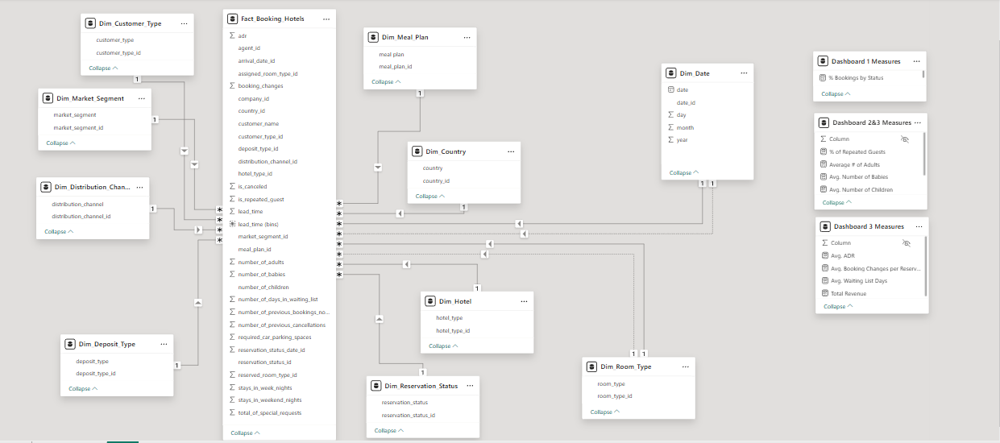
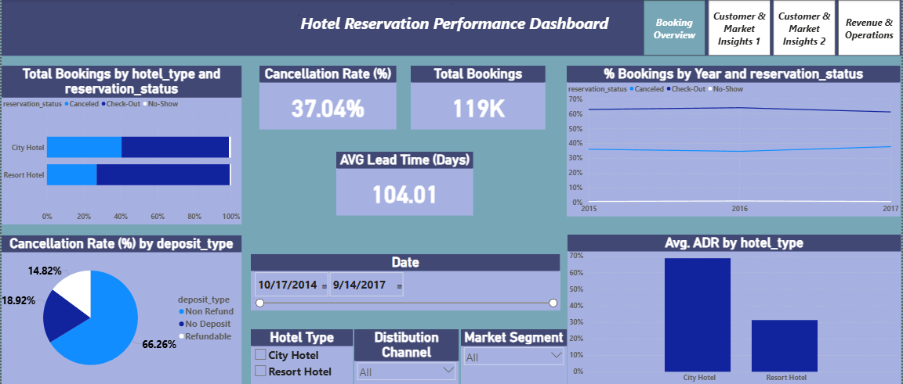
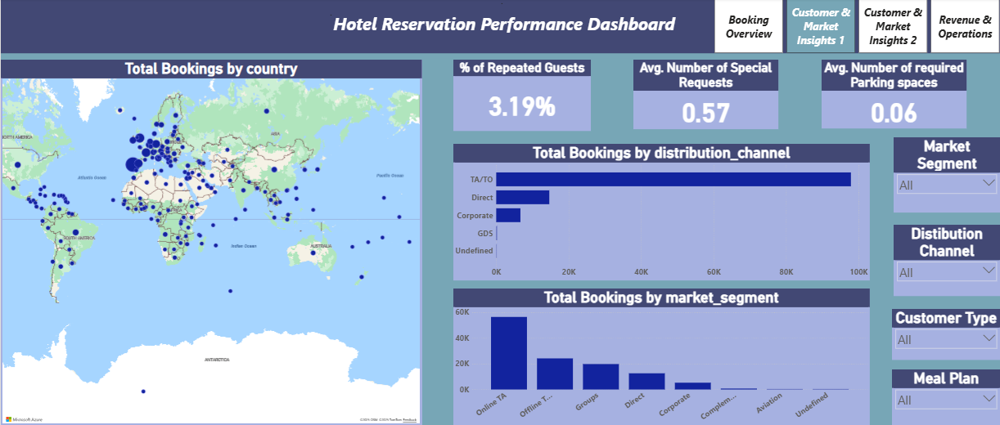
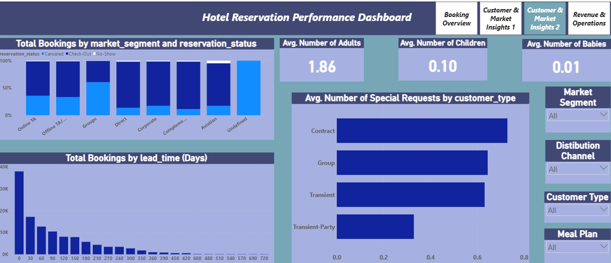
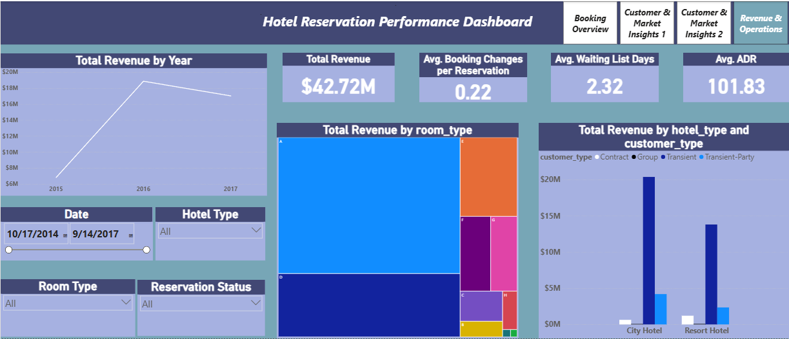

# 🏨 Hotel Reservation Performance Dashboard

## 📌 Project Overview

This project analyzes a large dataset of hotel bookings, containing **36 columns and 119,390 records** from **July 2015 to August 2017**. The data was cleaned, transformed, and enriched to ensure accuracy and consistency, enabling the development of interactive dashboards that provide valuable insights into booking patterns, cancellations, guest behavior, and operational performance.

---

## 🧾 Dataset Description

| Column Name                    | Description                                         |
| ------------------------------ | --------------------------------------------------- |
| hotel                          | Type of hotel (e.g., Resort Hotel or City Hotel)    |
| is_canceled                    | Whether the booking was canceled (1) or not (0)     |
| lead_time                      | Number of days between booking and arrival date     |
| arrival_date_year              | Year of arrival                                     |
| arrival_date_month             | Month of arrival (string, e.g., “July”)             |
| arrival_date_week_number       | Week number of year (1–53)                          |
| arrival_date_day_of_month      | Day of month (1–31)                                 |
| stays_in_weekend_nights        | Nights spent on weekends (Sat–Sun)                  |
| stays_in_week_nights           | Nights spent on weekdays (Mon–Fri)                  |
| adults                         | Number of adults                                    |
| children                       | Number of children                                  |
| babies                         | Number of babies                                    |
| meal                           | Type of meal booked (e.g., BB, FB, HB, SC)          |
| country                        | Country of origin of the guest                      |
| market_segment                 | Market segment (e.g., Direct, Corporate, Online TA) |
| distribution_channel           | Booking distribution channel (e.g., TA/TO, Direct)  |
| is_repeated_guest              | Whether the guest is a repeat guest (0/1)           |
| previous_cancellations         | Number of previous cancellations by guest           |
| previous_bookings_not_canceled | Number of previous non-canceled bookings            |
| reserved_room_type             | Reserved room type code                             |
| assigned_room_type             | Assigned room type code                             |
| booking_changes                | Number of changes/amendments to booking             |
| deposit_type                   | Deposit made (No Deposit, Non Refund, Refundable)   |
| agent                          | ID of booking agent (if any)                        |
| company                        | ID of company making the booking (if any)           |
| days_in_waiting_list           | Number of days booking was on waiting list          |
| customer_type                  | Type of customer (Transient, Contract, Group, etc.) |
| adr                            | Average Daily Rate (price per night per room)       |
| required_car_parking_spaces    | Number of car parking spaces required               |
| total_of_special_requests      | Number of special requests made by guest            |
| reservation_status             | Status (e.g., Canceled, Check-Out, No-Show)         |
| reservation_status_date        | Date of last status change                          |
| name                           | Guest name                                          |
| email                          | Guest email                                         |
| phone-number                   | Guest phone number                                  |
| credit_card                    | Credit card details (masked or encrypted)           |

---

## 🛠️ Tools & Technologies

* **Power BI** (Power Query / M, Data Modeling, DAX)

---

## 🧹 Data Cleaning

1. **Renamed columns** to readable/consistent names.
2. **Fixed invalid ADR values**: negative ADR values were converted to positive (absolute value).
3. **Handled missing values** by replacing missing entries with `Unknown` 
4. **Removed irrelevant columns** (PII or unused fields) such as `credit_card`, `phone-number`, `email`, `name` before analysis.

---

## 🧱 Data Modeling

Built a date dimension and converted the main table into a star schema with the following dimensions:

* `Dim_Date` 
* `Dim_Country`
* `Dim_Customer_Type`
* `Dim_Deposit_Type`
* `Dim_Distribution_Channel`
* `Dim_Hotel`
* `Dim_Market_Segment`
* `Dim_Meal_Plan`
* `Dim_Reservation_Status`
* `Dim_Room_Type`

Fact table: `Fact_Bookings`

Relationships: `Fact_Bookings` -> each `Dim_*` via keys.

---

## 📈 Key Insights

### Booking Overview

* **Cancellation Rate:** 37.04%
* **Total Bookings:** 119,390
* **Avg Lead Time (days):** 104.01

**Cancellation Rate by Deposit Type**

* Non Refund: 66.26%
* No Deposit: 18.92%
* Refundable: 14.82%

**Booking Share by Hotel Type (Avg ADR by hotel type shown as share)**

* City Hotel: 68.71%
* Resort Hotel: 31.29%

### Customer & Market Insights

* **% repeated Guests:** 3.19%
* **Avg special requests:** 0.57
* **Avg required parking spaces:** 0.06

**Bookings by distribution channel**

* TA/TO: 97,870
* Direct: 14,645
* Corporate: 6,677
* GDS: 193
* Undefined: 5

**Bookings by market segment**

* Online TA: 56,477
* Offline TA/TO: 24,219
* Groups: 19,811
* Direct: 12,606
* Corporate: 5,295
* Complementary: 743

**Top country (by bookings)**

* Portugal: 48,590

### Customer Composition & Lead Time

* Avg adults: 1.86
* Avg children: 0.10
* Avg babies: 0.01

**Avg special requests by customer type**

* Contract: 0.73
* Group: 0.64
* Transient: 0.63
* Transient-Party: 0.33

**Bookings by lead-time buckets**

* 0–30 days: 38,047
* 30–60 days: 17,193
* 60–90 days: 12,726
* 90–120 days: 10,475

### Revenue & Operations

* **Total Revenue:** $42,720,000 (approx)
* **Avg booking changes / reservation:** 0.22
* **Avg waiting list days:** 2.23
* **Avg ADR:** $101.83

**Total Revenue by Year**

* 2015: $6,818,116.56
* 2016: $18,870,601.20
* 2017: $17,034,907.37

---

## How to Use

**Explore the interactive dashboard directly on [NovyPro](https://project.novypro.com/QxFgsy).**

---

## 💡Conclusion & Recommendations

### 🛑 Cancellation Management
- Strengthen cancellation policies, especially for **Non-Refundable bookings** where cancellations remain surprisingly high.  
- Implement **flexible rebooking options** instead of outright cancellations to retain revenue.   

### 🤝 Customer Retention & Loyalty
- Launch **loyalty programs or perks** (discounts for repeated stays, free upgrades) to increase repeat guest rates beyond the current **3.19%**.  
- Personalize offers based on **booking history and special requests**.  

### 🌐 Channel Diversification
- Reduce dependency on **TA/TO** by strengthening direct booking channels (e.g., via hotel websites, apps, and targeted digital campaigns).  
- Offer **exclusive incentives for direct bookings** (better rates, free breakfast, loyalty points).  

### 🎯 Market Diversification
- Expand marketing campaigns beyond **Portugal** to reduce reliance on a single source market.    

### ⚙️ Operational Improvements
- Shorten average **waiting list times** (currently 2.23 days) to capture demand more efficiently.   

---

## 🖼️ Screenshots  

### 📊 Booking Overview 

### 📊 Customer & Market Insights 1  

### 📊 Customer & Market Insights 2  

### 📊 Revenue & Operations  

